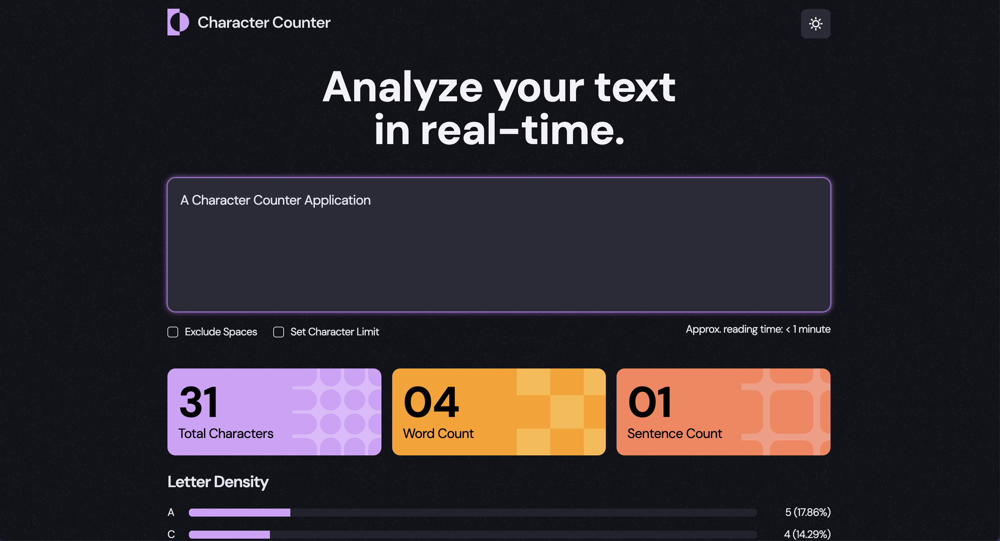

<h1 align="center">Character Counter App

| FE Project #2</h1>

<p align="center"></p>

This project is the first React application I built using the concept of **state**, rather than rendering a static page. It provides real-time analysis of user input, including character count, word count, sentence count, estimated reading time, and character density.

### <div align="center"><a href="">Go to Live Demo</a></div>

<br />

## Table of Contents

- [Project Requirements](#project-requirements)
- [Tech Stack](#tech-stack)
- [Directory Structure](#directory-structure)
- [State Management](#state-management)
- [Key Feature Implementations](#key-feature-implementations)
- [Localization Setup](#localization-setup)

<br />

## Project Requirements

- Users should be able to input text and select checkbox options to receive an analysis of the text
- ✅ **Live Text Analysis**: Updates character, word, sentence count, and character density with each keystroke
- ✅ **Responsive to User Options**: Reflects checkbox options like excluding spaces and setting character limits in the analysis
- ✅ **Character Density Visualization**: Displays density as progress bars for each character
- ✅ **Immediate Feedback**: Shows alert messages when the character limit is exceeded
- ✅ **Dark/Light Mode Toggle**: Allows users to switch between themes via an icon

<br />

## Tech Stack

- Framework: React 19.0.0
- Build Tool: Vite 6.2.0
- Styling: CSS
- Deployment: GitHub Pages

<br />

## Directory Structure

```bash
src
├─ App.css
├─ App.jsx
├─ assets
├─ components
│  ├─ BannerList/
│  ├─ DensityList/
│  ├─ Header/
│  ├─ Main/
│  ├─ Options/
│  ├─ ReadingTime/
│  └─ TextInput/
├─ context
│  └─ TextContext.jsx
├─ index.css
├─ index.jsx
├─ locales
│  └─ en.json
└─ utils
   ├─ arrayUtils.js
   ├─ formatText.js
   └─ textUtils.js
```

The components are nested as follows:

```jsx
<Header> // Logo, theme toggle, 'isDark' state
<Main> // 'content' state
  <TextInput /> // Input field
  <Options /> // Exclude spaces, character limit checkboxes
  <ReadingTime /> // Estimated reading time
  <BannerList /> // Character, word, sentence count
  <DensityList /> // Character density
```

<br />

## State Management

### State Management Principles

- **Colocation**: States are declared in the components where they’re used
- **State Lifting**: Shared states are lifted to the nearest common parent
- **Minimal Context**: Context API was not necessary for state management, as state lifting was sufficient
- **Minimal State**: Only essential states are declared; derived values (e.g. character counts) are calculated from existing state rather than stored separately

### States in the Project

All states are managed locally using `useState`.

1. **`isDark`**

   - Tracks current theme
   - Type: Boolean
   - Declared in: `<Header>`
   - Used in: `<Header>`

2. **`content`**

   - Stores user input and option selections
   - Type: Object
   - Declared in: `<Main>`
   - Used in: `<Main>` and its children

3. **`isOpen`**
   - Controls accordion toggle state
   - Type: Boolean
   - Declared in: `<DensityList>`
   - Used in: `<DensityList>`

<br>

## Key Feature Implementations

### Real-Time Input Handling

User input and checkbox values are synced to the `content` state using event handlers. The content object includes properties like `userinput`, `nospace`, `limit`, and `maxlength`. All inputs are controlled, meaning their values are tied directly to the state and updated dynamically.

> User input → Updates `content` → Inputs receive `value`/`checked` from `content`

<br />

#### Why Use Controlled Inputs

Using controlled inputs makes sense when:

- Input values affect other parts of the UI
- You need to validate or modify user input
- Input values can be changed programmatically (e.g. resetting fields)

In this project, all inputs are controlled to ensure consistency and allow future scalability—such as trimming characters that exceed the set limit.

<br />

### Live Text Analysis Based on User Options

Every time the user types or toggles an option, the app re-renders and recalculates the results. There’s no separate state for analysis data—everything is computed on the fly using utility functions based on the current `content`.

#### Logic for Character, Word, and Sentence Counts

```js
function noSpaceTotalChars(text) {
  return text.split(" ").join("").length;
}

function countWord(text) {
  const wordList = text.split(" ").filter((item) => item !== "");
  return wordList.length;
}

function countSentence(text) {
  const sentenceList = text
    .split(/[.?!]/) // Split by ".", "?", or "!"
    .map((item) => item.trim())
    .filter((item) => item !== "");
  return sentenceList.length;
}
```

#### Logic for Letter Density

```js
function getSortedDensity(text, minThreshold, ignoreCase, displayUpper) {
  const clearedText = removeSpecialCharsSpaces(text);
  const densityCount = getDensity(clearedText, ignoreCase, displayUpper);
  densityCount.sort((a, b) => b[2] - a[2]);
  const rangedDensity = densityCount.filter((item) => item[2] >= minThreshold);
  return rangedDensity;
  // Returns [['char', count, density], ...]
}
```

#### Rendering Results

`<BannerList>` and `<DensityList>` components pass the analysis data to their child components (`<Banner>` and `<Density>`) and render them as JSX arrays.

<br />

### Immediate Feedback When Character Limit is Exceeded

If the user input goes beyond the defined character limit, the input field’s border changes color, and a warning message is displayed.

This limit check isn’t stored as a separate piece of state—it’s derived directly from the existing `content` state on every render. The computed value is stored in the `isLimitReached` variable, which is shared between the `<Main>` component (for conditionally rendering the alert message) and `<TextInput>` (for applying visual styles to the input field).

#### Message Rendering Logic

```jsx
const isLimitReached =
  content.userinput &&
  content.maxlength &&
  content.userinput.length > content.maxlength;

return (
  <main>
    // ...
    <TextInput
      content={content}
      setContent={setContent}
      isLimitReached={isLimitReached}
    />
    {isLimitReached && <p className="limit-alert">{limitAlert}</p>}
    // ...
  </main>
);
```

<br />

### Accordion Toggle for Density List

To keep the UI clean and uncluttered, only the top 5 character densities are displayed by default. The rest are tucked away in an accordion component that the user can expand or collapse.

- Shows the top 5 characters by default
- Clicking “See more” reveals the full list
- Clicking “See less” collapses it back

The open/closed state of the accordion is managed using the `isOpen` state. Whether the list needs to be split—and which button label to show—is determined dynamically based on the total number of items.

#### Accordion Logic

```jsx
const shouldSplit = densityList.length > 5;
const [isOpen, setIsOpen] = useState(false);
const [firstList, secondList] = cutList(densityList, 5);
const handleClick = () => {
  setIsOpen((prev) => !prev);
};

  return (
    <div>
      <div>
        {firstList}
        {isOpen && secondList}
      </div>
      {shouldSplit && (
        <p onClick={handleClick}>
          {isOpen
            ? text.density_list_close_label
            : text.density_list_open_label}
        </p>
      )}
    </div>
  );
}
```

<br />

### Dark/Light Mode Toggle

The app’s theme is controlled by the `isDark` state. Based on its value, a corresponding class (`dark-mode` or `light-mode`) is applied to the `<body>`, which handles global styling.

Clicking the theme toggle icon updates isDark, triggering a re-render and applying the new theme class.

#### Why Context Wasn’t Used for Theme Toggling

Since `isDark` is only used at the top level and doesn’t need to be accessed across many components, there’s no need for React Context. Applying the theme class directly to `<body>` avoids prop drilling or introducing unnecessary context logic, keeping the solution simple and scalable for an app of this size.

<br />

## Localization Setup

Rather than using a full i18n library, this project implements a scalable structure that allows for easy future expansion into multiple languages.

### UI Text in JSON

All display text is stored in `locales/en`.json. To add more languages, you can simply create files like `locales/ko.json`. The setup supports dynamic values (e.g., `{reading_time_value}`) and basic pluralization logic.

```json
{
  "app_title": "Analyze your text in real-time.",
  "input_placeholder": "Start typing here (or paste your text)",
  "option_title_excl_space": "Exclude Spaces",
  "option_title_char_limit": "Set Character Limit",
  "reading_time_display": "Approx. reading time: {reading_time_value}",
  "reading_time_value": {
    "none": "0 minute",
    "one": "< 1 minute",
    "other": "< %d minutes"
  },
```

### Text Formatting Utility

A custom utility function handles placeholder substitution and pluralization logic:

```json
export function formatText(template, values, pluralRules = {}) {
  return template.replace(/\{(\w+)\}/g, (_, key) => {
    if (pluralRules[key]) {
      if (!values[key]) {
        return pluralRules[key].none;
      } else {
        return values[key] === 1
          ? pluralRules[key].one
          : pluralRules[key].other.replace("%d", values[key]);
      }
    }
    return values[key] ?? `{${key}}`;
    // Default to keeping the placeholder if missing
  });
}
```

### Passing UI Text Across the App with Context

A `TextContext` is used to provide UI text throughout the app, allowing all components to access text content without prop drilling. Since UI text is typically fixed at release and rarely changes during a single session—especially in most localization projects—using context does not introduce unnecessary re-renders.

This approach also improves maintainability by centralizing the management of UI text. It enables easier updates and scalability, such as supporting additional languages, without needing to change the component structure. Language support can be extended by enhancing how the app loads and manages language data.
